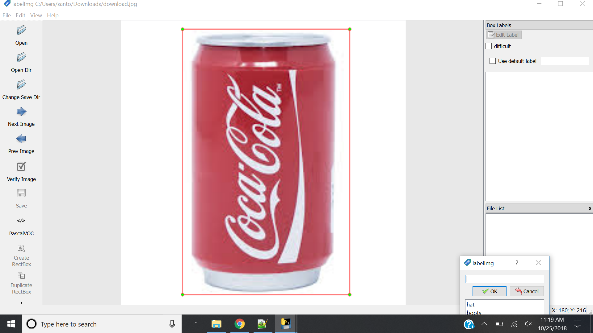

# Custom Object Detection

There are various flavours of YOLO, each having it's own advantages.

**Yolo trained with PascalVoc is trained to detect 20 objects**

**Yolo trained with Coco is trained to detect 80 objects**

**Yolo 9000 is trained to detect over 9000 objects!!**

You can retrain the models to detect additional models, but you need lots of computational power to retrain these objects because they have deeper network layers.
So if you need to train a custom object then it is adviced to select the tiny-yolo model as it has few layers compared to others and is the easiest to train with minimal hardware configuration (No need of GPU, CPU is sufficient).

## 1. Download a new model to train

### Tiny-YOLO

The version we are going to use is the tiny-yolo-voc.cfg
you can download the cfg file [here](https://github.com/opencv/opencv_extra/blob/master/testdata/dnn/tiny-yolo-voc.cfg).
You can download the weights file [here](https://github.com/leetenki/YOLOtiny_v2_chainer/blob/master/tiny-yolo-voc.weights).

Once you have the files 

Place the cfg file in the darkflow/cfg folder.
Place the weights file in the darkflow/bin folder.

## 2. Download the Images to train

For this exercise we are going train the model to detect Coke bottels and cans.
- So, next step is to collect images in bulk.
- Easiest way of doing this is downlod a google chrome plugin called "Download All Images".
- Now google images for coke, click on images tab if not there already.
- Scroll down to load about 500 images
- Now click on the zip icon in the top right corner of chrome to download a zip file of all the image downloaded.
- Filter out unwanted images.
- Create a folder image_files
- Load all the images into the new folder.
- Create a folder called annotation to store the xml files.

## 3. Annotate the images.

This is the most time consuming step of all, we need to annotate each image and generate a xml file which is used to train the model.
There are many ways to annotate images and generate an xml file, but the easiest way I fould was using a tool called
        
        LabelImg you can download it [here](https://tzutalin.github.io/labelImg/).
        
### LabelImg

```
1. Once you have download the file extract the file and run LabelImg.exercise
2. Click on open Dir to select the folder with images, and browse the folder image_files
3. Click on output Dir to selet the path for the output xml files generated, and browse to the annotation folder.
4. Click on Create rect box and draw a box around the coke bottle or the can displayed in the image and click save.
5. If there are multiple coke bottels or cans make sure to draw a rectangle box around all of them.
6. Click save to generate/save the xml file.
7. Click on next to continue to the next image.
8. Annotate atleast 500 images to get good accuracy for detecting the object in a image or a video.
```

## Setting up training environment

```
1. Go to bin folder make sure the tiny-yolo-voc.weights file is present.
2. Go to cfg folder copy the file tiny-yolo-voc.cfg file and paste it in the same folder.
3. Now rename the new file to tiny-yolo-voc-1c.cfg.
    Note: Here "1c" indicates that the model is trained for 1 object / class.
          It is adviced to rename the file as tiny-yolo-voc-[num_classes]c.cfg, in our case [num_classes] = 1 hence "tiny-yolo-voc-1c".
4. Open the file tiny-yolo-voc-1c scroll down to [region] and change the classes value to 1, since we are using it to identify one object / class
5. Above [Filters] in the second [convolutional] block change the filter to 30.
    Note: The value 30 is calculated using the formula:
            - Filters = 5*(num_classes+5) in our case num_classes = 1 therefore we get filters = 30
6. Save and close the tiny-yolo-voc-1c.cfg file.
7. Open darkflow/label.txt file, clear the file and enter "coke" since that is the only object we are trying to detect.
8. Save and close the file.
```

## Start the training
Open command prompt and execute the following command

```
Python flow --model cfg/tiny-yolo-voc-1c.cfg --load bin/tiny-yolo-voc.weights --train --annotation annotation --dataset image_files --gpu 1.0 --epoch 500.

Note: --gpu can be ommited if you are using Tensorflow CPU.
      --epoch is the number of iterations / times the model is trained with the training data set.
      You can stop the training by pressing "Ctrl+c" when the loss value decreases below 5%
      It is going to a long time to reduce from 5% to 0% depending on your sytem hardware.
      
```

## Test the model

1. Download a video containing a coke bottle or can name it as videofile.mp4 and place it in the darkflow directory
2. Run the command in cmd

```
python flow --model  cfg/tiny-yolo-voc-1c.cfg --load -1 --demo videofile.mp4 --saveVideo
```

3. Check the output in the video.mp4.


